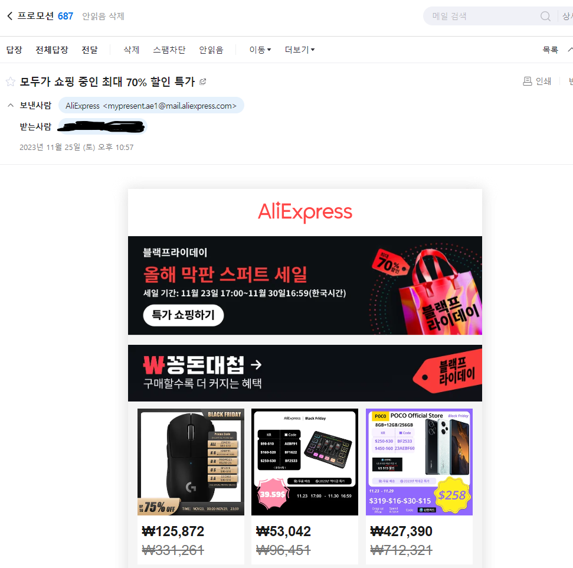

# CATCH
# 지속적인 고객 관리를 위한 시스템

# 프로젝트 개요
## 프로젝트 소개
CATCH 프로젝트는 CRM마케팅 전략을 기반으로 백화점에서 마케터들이 고객들을 대상으로 관리, 또는 이벤트를 제공 할 수 있는 서비스이다. 고객 정보를 토대로 성별, 나이, 멤버쉽 등 각각의 기준으로 통계 및 그래프를 제공하여 회사가 고객들의 소비 패턴들을 분석하고 마케팅 전략을 계획 할 수 있게 도움을 준다. 뿐만 아니라 마케팅 전략에 맞춰 이벤트를 제공 할 수 있게 회원들에게 이메일을 통한 광고를 전송하거나 멤버쉽 등급에 따라 쿠폰을 발급하는 등의 서비스를 구현해 회사가 고객 관리를 지속적으로 할 수 있게 한다.

## CRM 마케팅
CRM 마케팅이란, Customer Relationship Management의 약자로 고객 관계 관리라는 뜻이다. 기존 고객과의 관계를 중시하여 ‘고객이 어떻게 하면 더 많이 서비스를 이용하고 비용을 지불 할까?’ 에 대해 고민하는 전략이다. 고객데이터의 세분화를 실시하여 신규고객획득, 우수고객 유지, 고객가치증진, 잠재고객 활성화, 평생고객화와 같은 사이클을 통하여 고객을 적극적으로 관리하고 유도한다. 기존 마케팅이 단발적인 마케팅 전술이라면 CRM은 고객과의 지속적인 관계를 유지하면서 '한 번 고객은 평생고객'이 될수 있는 기회를 만들며, 평생고객화를 통해 고객의 가치를 극대화하는 것이다.

## 서비스 타켓 선정 
이번 프로젝트에서 서비스의 대상을 백화점으로 선정했다. 그 이유는  가장 먼저 많은 고객들을 대상으로 서비스를 제공하고 있는 업계이기 때문이다. 해당 프로젝트는 많은 고객들의 데이터를 분석하고 제공해주기 때문에 많은 이용자 수를 가지고 있는 곳이 필요했다. 뿐만 아니라 백화점은 유통 및 서비스 업계에 속해 있는데 해당 업계는 많은 고객들을 분석하고 이벤트를 기획을 하는 것이 회사매출에 가장 중요한 부분을 차지하고 있기 때문에 대상을 백화점으로 선정했다.

## CRM 마케팅 사례
<p align="center">


</p>

**마켓컬리**
  - 마켓컬리에서는 SMS 문자메시지를 통해 CRM을 하고있다. 유사한 성향을 가진 고객 집단을 분류해 맞춤형 할인 쿠폰 등 개인화 된 혜택을 제공하고 있다.
    
**알리 익스프레스**
  - 알리 익스프레스에서는 Email를 통해 CRM을 하고 있다. 특정 기간에만 진행하는 할인 행사를 인기있는 상품들을 위주로 보여줘 관심을 갖게 하여 행사에 참여하게끔 한다.

</br>
</br>

# 개발 환경
## 공통
버전 관리 및 협업: GitHub, Git, GitHub Project, Notion
데이터베이스: MariaDB
커뮤니케이션: Slack

## 프론트엔드
개발 환경: Visual Studio Code
프로그래밍 언어: HTML, CSS, JavaScript, Vue.js

## 백엔드
개발 환경: IntelliJ IDEA
프로그래밍 언어: Java 11
빌드 도구: Gradle
프레임워크: Spring, Spring Boot
보안: Spring Security, JSON Web Tokens (JWT)

</br>
</br>

# 요구사항 분석
## 사용자(회원)
|요청사항 명|요구사항 상세 설명|
|---|:---|
|**회원 가입 (일반 회원)**|회원은 이메일 인증을 통해 회원 가입을 할 수 있다.|
|**회원 가입 (소셜 회원)**|회원은 [구글] 소셜 수단으로 회원 가입 할 수 있다.|
|**회원 가입시 기본 입력**|정보	회원 가입 진행 시 이름, 이메일, 비밀번호, 생년월일, 주소를 입력해야 한다.|
|**개인정보 선택적 수집 및 이용에 대한 동의**|회원은 온라인회원 마케팅 수신동의(이메일, SMS)를 동의, 거부 할 수 있다.|
|**로그인 (일반 회원)** |일반 회원은 이메일, 비밀번호로 로그인 할 수 있다.|
|**로그인 (소셜 회원)**|소셜 회원은 [구글] 소셜 수단으로 로그인 할 수 있다.|
|**비밀번호 재설정 (일반 회원)**|일반 회원은 이메일 인증을 통해 비밀번호를 재설정 할 수 있다.|
|**마이 페이지**|회원은 마이페이지를 통해 개인 정보를 조회, 수정을 할 수 있다.|
|**개인 정보 수정**|회원은 주소, 마케팅 수신 동의를 수정 할 수 있다.|
|**개인 정보 조회**|자신의 아이디, 생년월일, 이메일, 주소, 마케팅 수신 동의를 조회할 수 있다.|
|**1:1 문의**|회원은 1:1 문의를 할 수 있다.|
|**개인의 쿠폰 상세 조회**|회원은 본인이 갖고 있는 쿠폰의 종류, 사용기간을 조회할 수 있다.|
|**개인의 포인트(적립금) 상세 조회**|회원은 본인이 갖고 있는 포인트(적립금), 사용기간을 조회할 수 있다.|
|**쿠폰 등록**|회원은 쿠폰 코드로 쿠폰을 등록 할 수 있다.|
|**개인의 문의 상세 조회**|회원은 본인의 문의 내용, 해당 문의의 답변을 조회할 수 있다.|
|**회원 탈퇴**|회원은 해당 서비스를 탈퇴할 수 있다.|
|**최근에 본 상품 목록**|회원은 본인이 최근에 본 상품의 목록을 확인할 수 있다.|
|**관심 상품**|회원은 상품에 좋아요를 눌러서 관심 상품에 등록할 수 있다.|
|**관심 상품 목록**|회원은 본인이 관심있는 상품의 목록을 조회할 수 있다.|

## 웹
|요청사항 명|요구사항 상세 설명|
|---|:---|
|**로그인 후 화면 (메인)**|로그인 후 회원 개인의 등급, 쿠폰, 포인트(적립금)을 조회할 수 있다.|
|**로그인 후 화면 (배너)**|로그인 후 관리자가 등록한 배너가 웹 메인에 노출되어야 한다.|

## 이벤트
|요청사항 명|요구사항 상세 설명|
|---|:---|
|**선착순 쿠폰**|선착순 쿠폰 이벤트|


## 사용자 등급
|요청사항 명|요구사항 상세 설명|
|---|:---|
|**사용자 등급 갱신**|사용자는 자신의 등급의 변동이 있을경우 실시간으로 확인해야한다.|

## 관리자
|요청사항 명|요구사항 상세 설명|
|---|:---|
|**회원 정보 조회**|관리자는 전체 또는 특정 회원의 정보를 입력해 조회할 수 있다.|
|**회원 정보 수정**|관리자는 회원의 정보를 수정 및 삭제 할 수 있다.|

## 마케터
|요청사항 명|요구사항 상세 설명|
|---|:---|
|**성별을 통한 회원 분류**|성별에 따른 회원 분포 확인할 수 있다.|
|**나이를 통한 회원 분류**|연령별 회원 분포를 확인할 수 있다.|
|**등급을 통한 회원 분류**|등급별 회원 분포 확인할 수 있다.|
|**광고성 메일**|마케터는 메일에 내용을 작성할 수 있고, 해당 내용을 메일로 보낼수 있다.|
|**쿠폰 관리**|마케터는 쿠폰 생성이 가능하다.|
|**회원 포인트 관리**|회원 포인트(적립금) 조회 및 수정할 수 있다.|
|**신규 이벤트 생성 및 이벤트 수정**|이벤트 생성 및 삭제 관리를 할 수 있다.|


## 상담사
|요청사항 명|요구사항 상세 설명|
|---|:---|
|**1:1 문의에 대한 답변**|회원이 남긴 1 : 1 문의에 대해 답변을 남길 수 있다.|

## 알람
|요청사항 명|요구사항 상세 설명|
|---|:---|
|**알람**|기한 만료 예정인 쿠폰 및 이벤트에 대한 정보를 확인할 수 있다.|

## 쿠폰
|요청사항 명|요구사항 상세 설명|
|---|:---|
|**발급된 쿠폰**|발급된 쿠폰은 수정 및 삭제가 불가능 하다.|
|**미발급 쿠폰**|미발급된 쿠폰은 수정 및 삭제가 가능하다.|

</br>

#  [📅 WBS](https://docs.google.com/spreadsheets/d/19pO974fKGKGOW3XLY8PIu9Kd5hFQFiLN8cf3-CNAI-o/edit?usp=sharing)
</br>

# [📈 ERD](https://www.erdcloud.com/d/4hBsL2CcK8LnCFWJL)
</br>

# [🖥 화면설계서](https://www.figma.com/file/J6p1dopme7dCpIH5zSnxHc/Catch?type=design&node-id=0%3A1&mode=design&t=OH7rpExEUxgtSPbR-1)
</br>

# [🎬API 명세 및 테스트 결과서](https://documenter.getpostman.com/view/32406846/2sA35LTyRZ)
</br>

# ⛏ 아키텍처 설계도

</br>


# UI/UX 단위 결과서

<details>
<summary> <h2> 로그인 & 로그아웃 </h3> </summary>

<h3> 고객: 로그인 </h3>

</br>

<h3> 고객: 로그아웃 </h3>

</br>

</details>


<details>
<summary> <h2> 고객: 문의 게시글 </h3> </summary>

<h3> 고객: 마이페이지 → 나의 게시글 보기 </h3>

</br>

<h3> 고객: 문의글 작성하기 </h3>

</br>

<h3> 고객: 문의글 수정하기 </h3>

</br>

<h3> 고객: 문의글 삭제하기 </h3>

</br>

</details>


<details>
<summary> <h2> 관리자: 문의게시글 </h3> </summary>

<h3> 관리자: 대시보드(메인화면) </h3>

</br>

<h3> 관리자: 문의게시글 리스트(검색) </h3>

</br>

<h3> 관리자: 게시글 상세보기 및 답변 달기 </h3>

</br>

<h3> 관리자: 게시글 답변 수정 </h3>

</br>

<h3> 관리자: 게시글 답변 삭제 </h3>

</br>

</details>

<details>
<summary> <h2> 쿠폰 </h3> </summary>

<h3> 관리자: 쿠폰리스트 및 검색 </h3>

</br>

<h3> 관리자: 쿠폰생성 </h3>

</br>

<h3> 고객: 쿠폰수령 </h3>

</br>

<h3> 고객: 수령 가능 쿠폰 및 내 쿠폰 보기 </h3>

</br>

<h3> 쿠폰 발행 및 알람 </h3>

</br>

</details>


<details>
<summary> <h2> 관리자: 고객리스트 </h3> </summary>

<h3> 관리자: 고객리스트 검색 </h3>

</br>

<h3> 관리자: 고객 상세보기, 메모, 활성화, 비활성화 </h3>

</br>

</details>

<details>
<summary> <h2> 관리자: 회사 계정 관리 </h3> </summary>

<h3> 관리자: 회사 계정 검색 </h3>

</br>

<h3> 관리자: 회사 계정 생성 </h3>

</br>

<h3> 관리자: 회사 계정 수정, 계정 활성화, 비활성화 </h3>

</br>

</details>


<details>
<summary> <h2> 관리자: 이벤트 </h3> </summary>

<h3> 관리자: 이벤트 생성 </h3>

</br>

</details>


<details>
<summary> <h2> 접근 권한 및 페이지 없음 (404, 403) </h3> </summary>


</br>

</details>


<details>
<summary> <h2> 관리자: 리스트 화면 페이징 처리 </h3> </summary>

</br>

</details>

</br>


<h1> 📋CI/CD 계획서 </h1>

## 목표 및 범위:
- 모놀리식 CRM 서비스와 핵사고날 아키텍처로 설계된 event 모듈 및 SpringBatch로 구성된 배치서비스 들을 미니서비스아키텍처로 구성하고
  이를 안정적으로 배포해 쿠버네티스 컨테이너 오케이스트레이션을 통해 대규모 데이터 및 트래픽에 대비할 수 있도록 합니다.

## 환경 및 도구:
- CI/CD를 위해 사용할 환경과 도구
    - CI 도구: GithubAction, 
    - CD 도구: Docker, Kubernetes

## 저장소:
- 코드를 저장할 저장소와 브랜치 전략
    - 저장소: GitHub
    - 브랜치 전략: 각 Feature 브랜치를 dev에 머지하고, dev 서버를 통해 AWS에 배포한 후 안정적인 서비스가 가능할 때 main 브랜치에 머지 후 버전관리합니다.

## 빌드 및 자동화 스크립트:
- CI/CD 파이프라인을 구축하기 위한 빌드 스크립트와 자동화 스크립트
    - 빌드 스크립트: Gradle
    - 자동화 스크립트: GitHub Action Script

## 배포 전략:
-  쿠버네티스를 이용한 롤링 배포

### 단계:

1. **GitHub 저장소 체크아웃**:
  - GitHub 저장소를 체크아웃합니다.

2. **kubectl 설치**:
  - kubectl을 설치합니다.

3. **AWS 자격 증명 구성**:
  - AWS 자격 증명을 구성합니다.

4. **클러스터 정보 업데이트**:
  - 클러스터 정보를 업데이트합니다.

5. **Amazon ECR 로그인**:
  - Amazon ECR에 로그인합니다.

6. **Docker 이미지 빌드 및 푸시**:
  - CRM 서비스 및 배치 서비스용 Docker 이미지를 빌드하고 Amazon ECR로 푸시합니다.

7. **Kubernetes에 서비스 적용 및 배포 재시작**:
  - CRM 서비스 및 이벤트 서비스와 배치 서비스를 Kubernetes에 적용하고 배포를 재시작합니다.

## 권한 및 보안:
- CI/CD 파이프라인의 접근 제어 및 보안 정책을 기술합니다.
    - 접근 제어: IAM
    - 보안 정책: 쿠버네티스 시크릿을 이용한 데이터 암호화, 보안 그룹 설정


## 문서화 :
- CI/CD 계획서 
    - 문서화: GitHub Readme 작성


</br>

<details>
<summary> <h1> 배포 결과 테스트 </h1> </summary>

## S3 버킷 생성


</br>

## 버킷 정책 편집


</br>

## Cloud Front 생성


</br>

## Cloud Front에 적용할 SSL 인증서 생성


</br>

## Route53에서 호스팅 영역 생성


- 가비아에서 등록한 도메인의 ns 레코드 값을 생성된 호스팅 영역의 ns 레코드 값을 수정


</br>

## 프론트 레코드 생성

- cloudfront의 엔드포인트 설정


</br>

## CloudFront의 DNS 세팅


</br>

## frontend git action
<details>
<summary> - frontend_depoly.yml </summary>
  
```
name: Deploy to AWS S3

on:
  push:
    branches:
    - dev

jobs:
  build-and-deploy:
    runs-on: ubuntu-latest
    steps:
    - uses: actions/checkout@v2

    - name: setup node.js
      uses: actions/setup-node@v2
      with:
        node-version: '20'

    - run: |
        echo "VUE_APP_FIREBASE_API_KEY=${{secrets.API_KEY}}" >> .env
        echo "VUE_APP_FIREBASE_AUTH_DOMAIN=${{secrets.DOMAIN}}" >> .env
        echo "VUE_APP_FIREBASE_PROJECT_ID=${{secrets.PROJECT_ID}}" >> .env
        echo "VUE_APP_FIREBASE_STORAGE_BUCKET=${{secrets.BUCKET}}" >> .env
        echo "VUE_APP_FIREBASE_MESSAGING_SENDER_ID=${{secrets.SENDER_ID}}" >> .env
        echo "VUE_APP_FIREBASE_APP_ID=${{secrets.APP_ID}}" >> .env
        echo "VUE_APP_FIREBASE_MEASUREMENTID=${{secrets.MEASUREMENT_ID}}" >> .env
        echo "VUE_APP_FIREBASE_VAP_ID=${{secrets.VAP_ID}}" >> .env
    - run: cat .env
    
    - name: npm install
      working-directory: ./
      run: npm install

    - name: npm firebase install
      working-directory: ./
      run: npm install firebase

    - name: npm run build
      working-directory: ./
      run: npm run build

    - name: setup aws cli
      uses: aws-actions/configure-aws-credentials@v2
      with: 
        aws-access-key-id: ${{secrets.AWS_S3_ACCESS_KEY}}
        aws-secret-access-key: ${{secrets.AWS_S3_SECRET_KEY}}
        aws-region: "ap-northeast-2"

    - name: deploy to s3
      run: |
        aws s3 cp ./dist s3://catchteam/ --recursive

```

</details>
</br>

## RDS 생성


## RDS 파라미터 그룹 설정
- 파라미터 그룹을 설정해주지 않으면 DB에 한글을 넣을때 에러 발생


- char 검색시 나오는 항목들 utf8mb4


- collation 검색시 나오는 항목들 utf8mb4_general_ci
  


## EKS 클러스터 생성


</br>

## 클러스터 서비스 역할 EKS로 설정


</br>

## 클러스터 이름 생성


</br>

## EKS 보안그룹 설정


</br>

## EKS 생성


</br>

## 노드그룹 생성


</br>

## 노드그룹 IAM 역할 설정


- IAM 역할 EC2 부여


- IAM 역할 EKS 권한 부여 


</br>

## 노드그룹 스펙 설정


</br>

## 노드그룹 크기 설정


</br>

## 노드그룹 생성 완료


</br>

## cert manager 설정
1. 터미널을 킵니다.

2. aws cli 설치 및 aws configure 설정

- aws cli 설치
https://docs.aws.amazon.com/ko_kr/cli/latest/userguide/getting-started-install.html

- aws configure 설정

```
aws configure
> AWS Access Key ID: aws 액세스 키 입력
> AWS Secret Access Key: aws 비밀 액세스 키 입력
> Default region name: region name 입력
> Default output format: output format 입력
```

3. kubectl 설치
- mac 
```
brew install kubectl
```
- 윈도우

```
winget install -e --id Kubernetes.kubectl
```

4. 설치 확인
```
kubectl version --client
```

5. 클러스터 설정
aws에서 클러스터 생성 후
```
aws eks update-kubeconfig --region ap-northeast-2 --name catch-cluster
```

6. cert-manager 생성
```
kubectl create namespace cert-manager
```

7. Helm 설치
```
helm repo add jetstack [https://charts.jetstack.io](https://charts.jetstack.io/)
helm repo update
helm install cert-manager jetstack/cert-manager --namespace cert-manager --version v1.5.0 --create-namespace --set installCRDs=true
// ingress_cert 파일이 있는곳으로 이동
cd ./k8s
```
<details>
<summary> - ingress_cert.yml</summary>
  
```
apiVersion: cert-manager.io/v1
kind: ClusterIssuer
metadata:
  name: letsencrypt-prod
spec:
  acme:
    # 인증서 서버 주소. 해당 서버의 리소스를 통해 인증서 발행
    server: https://acme-v02.api.letsencrypt.org/directory
    # 인증서 만료 또는 갱신 필요시 알람 email
    email: s99s4481@gmail.com
    privateKeySecretRef:
      name: letsencrypt-prod
    solvers:
      - http01:
          ingress:
            class: nginx
---
# ClusterIssue를 사용하여 Certificate 리소스 생성 : Certificate리소스 생성시에 인증서 발급
apiVersion: cert-manager.io/v1
kind: Certificate
metadata:
  name: catch-com-tls
  namespace: default
spec:
  secretName: catch-com-tls
  duration: 2160h #90days
  renewBefore: 360h #before 15day
  issuerRef:
    name: letsencrypt-prod
    kind: ClusterIssuer
  commonName: server.catch-crm.shop
  dnsNames:
    - server.catch-crm.shop
```

</details>
</br>

8. ingress aplly

```
kubectl apply -f ingress_cert.yml
kubectl get certificate
// 문제가 있다면 지우고 다시 시도
kubectl delete -f ingress_cert.yml
```

</br>

## nginx ingress controller 설정
```
kubectl apply -f https://raw.githubusercontent.com/kubernetes/ingress-nginx/controller-v1.1.1/deploy/static/provider/cloud/deploy.yaml
```
</br>

## ingress HOSTS 확인


## route53에 cname으로 생성된 로드밸런서 dns 넣기


## elastiCache (redis) 생성


## k8s secret 설정
```
kubectl create secret generic db-infos \
--from-literal=DB_HOST= DB_HOST\
--from-literal=DB_USERNAME= DB_USERNAME \
--from-literal=DB_PASSWORD= DB_PASSWORD \
--from-literal=REDIS_HOST= REDIS_HOST \
--from-literal=GOOGLE_EMAIL= GOOGLE_EMAIL \
--from-literal=GOOGLE_SMTP= GOOGLE_SMTP \
--from-literal=JWT_SECRETKEY= JWT_SECRETKEY \
--from-literal=SYMMETRICKEY= SYMMETRICKEY \
--from-literal=FIREBASE_JSON= FIREBASE_JSON \
```

## backend git action
<details>
<summary> - backend_depoly.yml </summary>
  
```
name: deploy Catch-Backend
on:
  push:
    branches:
      - dev
jobs:
  build-and-deploy:
    runs-on: ubuntu-latest
    steps:
      - name: checkout github
        uses: actions/checkout@v2
      - name: install kubectl
        uses: azure/setup-kubectl@v3
        with:
          version: "v1.25.9"
        id: install
      - name: configure aws #aws configure 팀 키값
        uses: aws-actions/configure-aws-credentials@v1
        with:
          aws-access-key-id: ${{ secrets.AWS_ACCESS_KEY_ID }} # 추가 해줘야함
          aws-secret-access-key: ${{ secrets.AWS_SECRET_ACCESS_KEY }} # 추가 해줘야함
          aws-region: ap-northeast-2
      - name: update cluster information
        run: aws eks update-kubeconfig --name catch-cluster --region ap-northeast-2
      - name: Login to ECR
        id: login-ecr
        uses: aws-actions/amazon-ecr-login@v1

      ################ build and push #################
      - name: create-json
        uses: jsdaniell/create-json@v1.2.3
        with:
          name: "catch-push-firebase-adminsdk-x6w7k-bded31fa6b.json"
          json: ${{ secrets.FIREBASE_JSON }}
          dir: './crm/src/main/resources/'

      - name: build and push docker image to ecr (catch-crm)
        env:
          REGISTRY: 533267078155.dkr.ecr.ap-northeast-2.amazonaws.com # ECR주소
          REPOSITORY: catch-crm
          IMAGE_TAG: latest
        run: |
          docker build \
          -t $REGISTRY/$REPOSITORY:$IMAGE_TAG \
          -f ./crm/Dockerfile ./crm
          docker push $REGISTRY/$REPOSITORY:$IMAGE_TAG
      - name: build and push docker image to ecr (catch-batch)
        env:
          REGISTRY: 533267078155.dkr.ecr.ap-northeast-2.amazonaws.com # ECR주소
          REPOSITORY: catch-batch
          IMAGE_TAG: latest
        run: |
          docker build \
          -t $REGISTRY/$REPOSITORY:$IMAGE_TAG \
          -f ./batch/Dockerfile ./batch
          docker push $REGISTRY/$REPOSITORY:$IMAGE_TAG

      ################ apply ################
      - name: eks kubectl crm apply
        run: |
          kubectl apply -f ./crm/k8s/catch-crm-serv.yml
          kubectl rollout restart deployment crm
      - name: eks kubectl batch apply
        run: |
          kubectl apply -f ./batch/k8s/catch-batch-serv.yml
          kubectl rollout restart deployment batch

```

</details>
</br>

</details>

